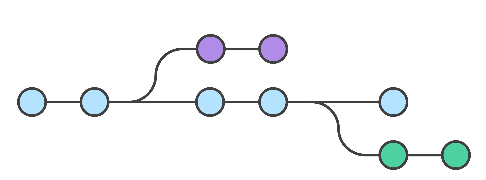
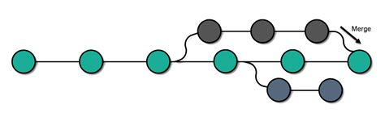

# **Работа с Git**
## **1. Проверка наличия установленного Git**
В терминале выполнить команду `git version`.
Если  Git установлен, появится сообщение с информацией о версии программы. Иначе будет сообщение об ошибке.
## **2. Установка Git**
Загружаем последнюю версию Git с сайта:

https://git-scm.com/downloads

Устанавливаем с настройками по умолчанию.
## **3. Настройка Git**
При первом использовании Git необходимо представиться. Для этого нужно ввести в терминале две команды: 
```
git config --global user.name "Ваше имя"
git config --global user.email "Почта@example.com" 
```
## **4. Создание репозитория**
Получить репозиторий можно двумя способами:
1. В терминале переходим к папке, в которой хотим создать репозиторий. Выполнянем команду:
```
git init
```

2. Клонирование существующего репозитория Git.
Для получения копии существующего Git-репозитория необходимо использовать команду 
```
git clone
```
>*После команды* `git clone` *указывается URL-ссылка*
## **5. Запись изменений в репозиторий**
Каждый файл в репозитории может находиться в одном из двух состояний: под версионным контролем (отслеживаемые - tracked) и нет(неотслеживаемые - untracked).
1. Для определения состояния в котором находятся файлы в репозитории используется команда
```
git status
```
2. Для помещения файла под версионный контроль используется команда 
```
git add
```
>*Также эта команда используется для добавления файла или файлов к следующему коммиту.*

3. Коммит изменений в отслеживаемом файле выполняется коммандой
```
git commit -m ""
```
>*Любые изменения  для которых  не выполнена команда git add после редактирования — не войдут в этот коммит.*

4. Для того, чтобы увидеть разницу между текущим файлом и закоммиченным файлом используется команда
```
git diff
```
## **6. Просмотр истории коммитов**
Для просмотра сделанных коммитов используется команда
```
git log
```
>*Команда* `git log` *перечисляет коммиты, сделанные в репозитории в обратном к хронологическому порядке — последние коммиты находятся вверху.*
## **7. Перемещение между сохранениями**
Команда 
```
git checkout
```
позволяет переключаться между последними коммитами.

>*Для перехода к нужному коммиту необходимо использовать команду* `git checkout` *с указанием уникального идентификатора, генерируемого для каждого коммита.*

Если необходимо вернуться к актуальному состоянию и продолжить работу, используется команда
```
git checkout master
```
## **8. Работа с ветками в Git** 
### 1. Создание веток

Для создания новой ветки в Git - необходимо воспользоваться командой 
```
git branch <имя ветки>
```
> Для создания и последующего перехода в новую ветку 
можно использовать команду` git checkout -b <Имя ветки>`.

### 2. Слияние веток в Git

Процедура объединения веток называется слияние. Для осуществления процедуры слияния веток, необходимо воспользоваться командой
```
git merge <имя ветки>
```

### 3. Разрешение кофликтов

При слиянии веток, Git объединяет изменения внесенные в одну ветвь, с изменениями внесенными в другую. Часто Git автоматически завершает слияние. Однако если Git обнаруживает, что изменения, внесенные в одну ветвь, конфликтуют с изменением, сделанным в другой, он предложит устранить конфликт, и предложит выбрать, какие же изменения записать.

### 4. Удаление веток в Git

Для удаления ветви в Git используется команда
```
git branch -d <имя ветки>
```
> В случае если удаляемая ветвь не была слита, Git выдаст предупреждение.
Для принудительного удаления ветви используется команда
`git branch -D <имя ветки>`

### **9. Игнорирование файлов в Git**
Не все файлы в проекте должны отслеживаться Git. Для того,чтобы файлы не индексировались и не попадали в репозиторий, необходимо выполнить следующие действия:

* Нужно самостоятельно создать и разместить в корне проекта или нужной подпапке файл ***.gitignore***.
* Затем необходимо вручную отредактировать файл ***.gitignore***, чтобы указать в нем новые файлы, которые должны быть проигнорированы.

## **10. Справочные материалы**
1. Для получения дополнительной информации по командам Git перейдите по ссылке [30 команд Git, необходимых для освоения интерфейса командной строки Git] (https://habr.com/ru/company/ruvds/blog/599929/?ysclid=l4to2gmoo2481088389)
2. Для изучения системы контроля версий Git перейдите по ссылке [Git Book] (https://git-scm.com/book/ru/v2)
