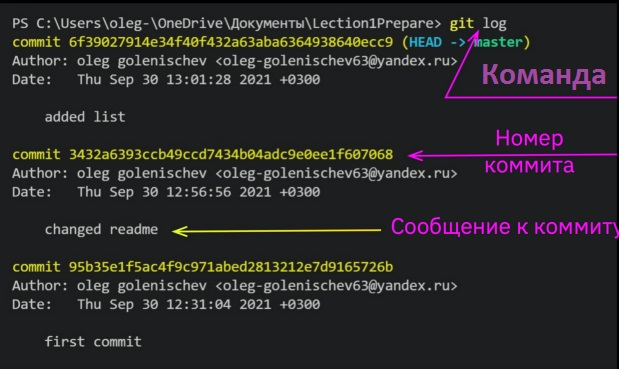
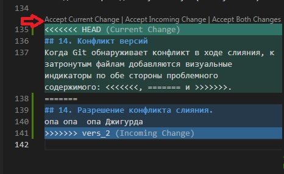
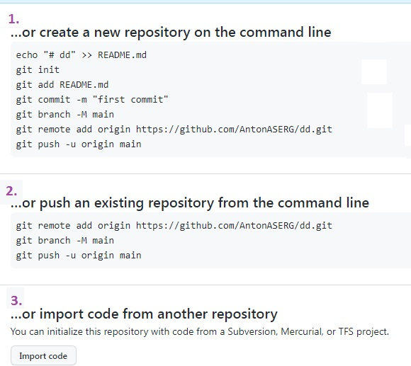

# Работа с GIT
## 1. Проверка наличия установленного GIT
В терминале необходимо выполнить команду `git version`
Если Git установлен, появится информация о версии программы. Иначе будет сообщение об ошибке.

## 2. Установка Git
Загружаем последнюю версию Git c сайта

https://git-scm.com/downloads

Устанавливаем с настройками по умолчанию.

## 3. Настройка Git 
При первом использовании Git необходимо представиься, для  чего нужно ввести в терминале 2 команды
```
Git config --global user.name "Ваше имя"
Git config --global user.email "Почта@example.com"
```

##  4. Создание репозитория
Получить репозиторий можно двумя способами.
1. В терминале переходим к папке, в которой хотим создать репозиторий -  выполняем команду:
```
git init
```
2. При помощи "клонирования" уже существующего репозитория.
```
git clone <адрес репозитория>
```

## 5. Проверка текущего состояния Git
Чтобы проверить текущее состояние Git, на предмет, есть ли изменения, которые нужно cохранить, вводится команда:
```
git status
```
## 6. Добавление файлов к следующему сохранениию (коммиту)
Команда:
```
git add "имя файла.расширение"
```
Добавляет содержимое рабочего каталога в индекс  для последующего коммита. Эта команда дается после добавления файлов. Писать название целиком не обязательно: терминал дозаполнит данные автоматически, если нажать клавишу `TAB`.

## 7. Сохранение версии в Git (Создание коммита)

Чтобы зафиксировать изменения в Git, необходимо создать коммит при помощи  команды
```
git commit
```
Для удобного ориентирования в созданных версиях к указанной команде добавляют сообщение при помощи дополнительной команды:
```
git commit -m "комментарий к сохранению"
```
Ели файл находится  уже в отслеживании Git, то сохранять и фиксировать версии добавляя комментарии, можно при помощи одной команды
```
git commit -a -m = git add + git commit -m
```
## 8. Сравнение между сохраненной версией и тем, что находится в процессе выполнения
Чтобы увидеть разницу между текущим файлом и закоммиченным файлом, введи команду
```
git diff
```
## 9. Просмотр истории коммитов
Для вывода на экран истории всех коммитов с их хеш-кодами введите команду:
```
git log
```
**Наиболее распространенные опции для команды `git log` :**
* `-p` - Показывает патч для каждого коммита.
* `--stat` - Показывает статистику измененных файлов для каждого коммита.
* `--shortstat` - Отображает только строку с количеством изменений/вставок/удалений для команды --stat.
* `--name-only` - Показывает список измененных файлов после информации о коммите.
* `--name-status` - Показывает список файлов, которые добавлены/изменены/удалены.
* `--abbrev-commit` - Показывает только несколько символов SHA-1 чек-суммы вместо всех 40.
* `--relative-date` - Отображает дату в относительном формате (например, «2 weeks ago») вместо стандартного формата даты.
* `--graph` - Отображает ASCII граф с ветвлениями и историей слияний.
* `--pretty` - Показывает коммиты в альтернативном формате. Возможные варианты опций: oneline, short, full, fuller и format (с помощью последней можно указать свой формат).
* `--oneline` - Сокращение для одновременного использования опций --pretty=oneline --abbrev-commit.

## 10. Перемещения между сохранениями
Для перехода от одного коммита к другому используйте команду: 
```
git checkout commit "номер коммита"
```
Номера всех коммитов отображаются в режиме `git log` 

*Для выхода из данного режима нажмите клавишу*  **Q.**

Чтобы вернуться к актуальному состоянию и продолжить работу с проектом введите команду
```
git checkout master
```
Важно - текущий коммит обозначен подписью `HEAD`

## 11.  Игнорирование файлов
Git рассматривает каждый файл в вашей рабочей копии как файл одного из трех нижеуказанных типов.

* Отслеживаемый файл — файл, который был предварительно проиндексирован или зафиксирован в коммите.
* Неотслеживаемый файл — файл, который не был проиндексирован или зафиксирован в коммите.
* Игнорируемый файл — файл, явным образом помеченный для Git как файл, который необходимо игнорировать. Как правило они находятся в репозитории и используются внутри основного проекта. 
Игнорируемые файлы отслеживаются в специальном файле `.gitignore`, который создается в корневом каталоге репозитория. В этом файле вручную списком прописываются игнорируемые файлы (`имя файла. расширение`)

## 12. Работа с ветками
Просмотреть список веток позволяет команда: 
```
git branch
```
 Она же дает возмоность создавать:
 ```
git branch <ИМЯ ВЕТКИ>
```
 переименовывать:
 ```
git branch -m <ИМЯ ВЕТКИ>
```
и удалять ветки:
 ```
git branch -d <ИМЯ ВЕТКИ> (безопасно с сохранением неслитых изменений)
git branch -D <ИМЯ ВЕТКИ> (принудительно)
```
Однако она но не позволяет переключаться между ветками или выполнять слияние разветвленной истории. Именно поэтому команда `git branch` тесно связана с командами  `git checkout` и `git merge`.
```
git checkout ИМЯ ВЕТКИ - переключиться между ветками
```

## 13. Слияние веток
Слияие происходит в несколько этапов:
1. После сохранения всех изменений переходим в принимающую ветку (как правило *MASTER*)
2. Выполняем команду `git merge <название ветки>`, которая будет объединена с принимающей:  
```
git merge <название ветки>
```
3. Удаляем присединенную ветку  (см. пункт 12)

## 14. Конфликт версий
Когда Git обнаруживает конфликт в ходе слияния, к затронутым файлам добавляются визуальные индикаторы по обе стороны проблемного содержимого: <<<<<<<, ======= и >>>>>>>.
содержимое перед отметкой ======= относится к принимающей ветке, а все, что указано после нее, — к ветке, для которой выполняется слияние.

После обнаружения конфликтующих участков кода вы можете исправить их по своему усмотрению, выбрав один из пунктов появившегося меню:


* Accept Current Change - сохранить текущую версию (принимающей ветки HEAD),
* Accept Incomming Change - сохранить версию сливаемой (принимаемой ветки),
* Accept Both Change - сохранить обе версии.

После разрешния конфликта обязательно провести коммит слияния.

## 16. GitHub. Работа с удаленными репозиториями.


GitHub - онлайн сервис для работы с удаленными репозиториями. 

Для того чтобы склонировать внешний репозиторий на наш ПК используйте команду в терминале локального репозитория:
``` 
git clone <<HTTPS адрес репозитория>>
```

Для того чтобы разместить локальный репозиторий на GitHub, Вам необходимо в аккаунте выбрать пункт "+ Новый репозиторий", задать ему имя и выбрать  один из трех сценариев
1. Создать новый репозитарий в программе GitHub
2. Загрузить локальный репозитарий с Вашего ПК
3. Импортировать код из GitHub или другого сервиса



Основными командами при взаимодействии локального и удаленного репозитория являются
```
git push - позволяет отправить нашу версию репозитория на внешний репозиторий. ТРЕБУЕТ АВТОРИЗАЦИИ на внешнем репозитории

git pull - позволяет скачать все из текущего репозитория и автоматически
сделать merge с нашей версией
```
## 17. Совместная работа в GitHub.
```
pull request

➜ команда для предложения изменений
➜ запрос на вливание изменений в репозиторий
```
Порядок совместной работы:
Ответственный за проект создает аккаунт. а другие пользователи дают команду pull request

1. Сделать fork репозитория на GitHub
2. Создать clone (`git clone`) совместной версии в своем локальном репозитории
3. Создать новую ветку и в нее вносить свои изменения
4. Зафиксировать изменения (сделать коммиты)
5. Отправить свою версию в свой GitHub (`git push --set -u origin <<Имя Вашей ветки>>`)
6. На сайте GitHub нажимаем кнопку `pull request`