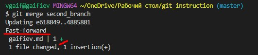

# Работа с Git.
## 1. Проверка наличия установленного Git
В терминале выполнить команду `git version`
Если Git установлен, появится сообщение с информацией о версии программы. Иначе будет сообщение об ошибке.

## 2. Установка Git
Загружаем последнюю версию Git с сайта:
    
    https://git-scm.com/download/win

Устанавливаем с настройками по умолчанию.

## 3. Настройка Git
При первом использовании Git необходимо представиться. Для этого нужно ввести в терминале две команды:
```
git config --global user.name "Ваше имя"
git config --global user.email "Почта@example.com"
```

## 4. Создание репозитория
Получить репозиторий можно двумя способами.
1. В терминале переходим к папке, в которой хотим создать репозиторий:
```
git init
```
2. Второй способ - клонирование. 
В терминале необходимо использовать команду: 
```
git clone
```
Команда `git clone` работает как обёртка над некоторыми командами. Она создаёт новый каталог, переходит внутрь и выполняет `git init` для создания пустого репозитория, затем добавляет новый удалённый репозиторий (git remote add) для указанного URL, выполняет `git fetch` для этого репозитория и, наконец, извлекает последний коммит в ваш рабочий каталог, используя `git checkout`.

## 5. Определение состояния файлов
Основной инструмент, используемый для определения, какие файлы в каком состоянии находятся — это команда git status. Если вы выполним эту команду сразу после клонирования, то увидим что-то вроде этого:
```
$ git status
On branch master
nothing to commit, working tree clean
```
Это означает, что у нас чистый рабочий каталог, другими словами — в нем нет отслеживаемых измененных файлов. Git также не обнаружил неотслеживаемых файлов.

## 6. Отслеживание новых файлов
Для того чтобы начать отслеживать (добавить под версионный контроль) новый файл, используем команду:
```
git add - позволяет внести в индекс — временное хранилище — изменения, которые затем войдут в коммит. 
```
Чтобы начать отслеживание файла `<name file>`, выполним следующее:
```
$ git add <name file>
```
Также есть другие команды для отслеживания:

`git add -a` - выполняет все изменения

`git add .` - размещает новые файлы и модификации без удаления (в текущем каталоге и его подкаталогах).
## 7. Создание(фиксация) коммита
Команда:
```
git commit
```
берёт все данные, добавленные в индекс с помощью `git add`, и сохраняет их слепок во внутренней базе данных, а затем сдвигает указатель текущей ветки на этот слепок.

Сначала нужно отследить файл с 6 раздела и создаем коммит следующей командой:
```
git commit -m "Назвать изменение или комментарий"
```
Можно одновременно отследить файл и добавить фиксацию следующей командой:
```
git commit -am "Назвать изменение или комментарий"
```
## 8. Просмотр истории коммитов
Просмотра истории коммитов, начиная с самого начала и до текущего проекта. В истории коммитов можно узнать информацию о каждом коммите, в котором укаызваются хэш-код, автора, дата и время.
Чтобы узнать информацию об истории фиксированных коммитов используем команду:
```
git log
```
Получить подробную информацию о каждом в виде патчей по файлам из коммитов
можно, добавив ключ -p:
```
git log -p
```
Вывод истории коммитов в строчном виде, состоящих из хэш-кодов:
```
git log --oneline
```
Для выхода из просмотра истории коммитов нужно нажать на английской раскладке `"q"`
## 9. Изменение последнего коммита
Если допустили ошибку в сообщении коммита, можно изменить с помощью команды:
```
$ git commit --amend
```
## 10. Разница между текущим файлом и закономиченным файлом
Для вывода изменений в файлах по сравнению с последним коммитом, используем команду:
```
git diff
```
выводит изменения в файлах, которые еще не были добавлены в индекс и сравнение происходит с последним коммитом.
## 11. Переключение между сохранениями коммитов
Для переключения используем команду:
```
git checkout (достаточно первые 4 символа, так называемое хэш-код)
```
Для уточнения хэш-кода после `git checkout` можно выяснить командой `git log` и скопировать первые 4 символа имя хэш кода.
Для того, чтобы вернуться в последний коммит актуального состояния файла, нужно воспользоваться командой:
```
git checkout master
```
## 12. Создание новой ветки
Создать ветку, не переключаясь на нее можно командой:
```
git branch <имя ветки>
```
Затем переключиться на ветку:
```
git checkout <имя ветки>
```
*Важно понимать, что ветка берет свое начало не от ветки, а от последнего коммита который находиться в той ветке, в которой вы находились.*
## 13. Слияние веток
Ветка обычно заканчивается merge коммитом. Чтобы объединить ветки в одну ветку, необходимо переключиться на ту ветку, которую хотим объединить ветку, в терминале  командой: 
```
git checkout <имя ветки>
```
Затем выполнить команду:
```
git merge <имя ветки>
```
После этого выскочит интерфейс с тремя вариантами: сохранить с текущей ветки, сохранить со второй ветки, сохранить с обе. И затем закоммитить.
Существует другая ситуация при объединении веток, в которой `merge` может произойти без merge коммите. Дело в том, что если в одной из веток не произошло никаких изменений, то необходимость в merge коммите с двумя предками отпадает. В таком случае, при слиянии веток, Git просто сделает пометку о том, что дальше будут идти коммиты той ветки с которой эта ветка была объединена. Такая манипуляция с `merge` при слиянии без изменений свойств, но только добавив информацию называется слияние-перемотка (`fast-forward merge`), визуально это можно представить вот так:


## 14. Добавление изображения
Для того, чтобы сделать страницу более увлекательной, можно добавить изображения со следующей командой:
```

```
## 15. Игнорирование файлов
Файл .gitignore указывает, какие неотслеживаемые файлы Git должен игнорировать.
Он может игнорировать файлы или каталоги, содержащие шаблон подстановки:
1. Комментарии
2. Слэш
3. Буквальные имена файлов
4. Подстановочные символы
5. Квадратных скобок
6. Персональные правила
`.gitignore` — это простой текстовый файл, в каждой строке которого содержится шаблон, который файлы или каталоги следует игнорировать.
Чтобы игнорировать файлы под шаблоном, нужно создать файл с именем **.gitignore** и внутри файла прописать игнорируемые файлы или создать правила.