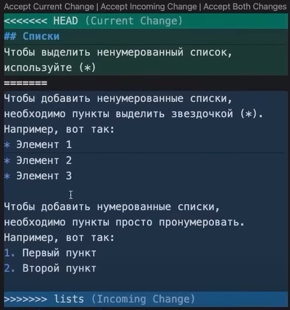

# **_Работа с git_**
## 1. **Проверка наличия установленного git**
В терминале выполнить команду **`git --version`**
Если git установлен, появится сообщение с информацией о версии программы. Иначе будет сообщенние об ошибке.

## 2. **Установка git**
Загружаем последнюю версию git с сайта:

https://git-scm.com/downloads

Устанавливаем с настройками по умолчанию.

## 3. **Настройка git**
При первом использовании git необходимо представиться. Для этого нужно ввести в терминале две команды:
```
git config --global user.name "Имя"
git config --global user.email "Почта"
```

## 4. **Создание репозитория**
Получить репозиторий можно двумя способами.
1. В терминале переходим к папке, в которой хотим создать репозиторий. Выполянем команду:
```
git init
```
2. Клонировать существующий репозиторий git из любого места. Сделать это можно так:
```
git clone <адрес репозитория>
```

## 5. **Начало работы**
1. Создаём файл с раширением .md
2. Добавим созданый файл для отслеживания командой:
```
git add filename.md
```
**_Например:_**
```
git add git_instruction.md
```
## 6. **Проверяем отслеживается ли файл с помощью git и сохраняем изменения**
1. Фиксируем изменения в репозитории с помощью команды (Комметарий нужен для того чтобы понять что мы изменили)
```
git commit -m "Сюда написать какой-нибудь комментарий"
```
2. Далее в терминале вводим команду для того чтобы проверить все ли сделано правильно:
```
git status
```
Терминал должен сказать 
> nothing to commit, working tree clean

Если терминал говорит
>Changes not staged for commit

Вернись к пункту 5.2

## 7. **Фиксация изменений в git**
1. После того как мы внесли некоторые изменения в файл нам необходимо ввести команду:
```
git add filename.md
```
Имя файла можно не писать полностью, достаточно нажать кнопку `Tab` на клавиатуре и имя файла автоматически появится
2. Далее нам необходимо зафиксировать изменения в файле с помощью команды:
```
git commit -m "Комментарий о изменениях"
```

## 8. **Просмотр всех фиксаций**
1. После того как мы сделали несколько фиксаций, мы можем посмотреть о них иформацию с помощью команды:
```
git log
```
2. Эта команда выдаст нам список всех изменений

>commit 573eef08f5df6ce26c24f9cdcef16bfb7670baf4

Название самой фиксации

>Author: «Andrei» <Spectacul9r@mail.ru>

Имя и почта того кто делал эту фиксацию

>Date:   Tue Jun 28 20:05:19 2022 +0500

дата и время фиксации

>Добавили раздел 6 - Проверяем отслеживается ли файл с помощью git и сохраняем изменения

комменнтарий к фиксации

## 9. **Просмотр изменений между сохранением и последней фиксацией**
Вводим в терминал команду 
```
git diff
```
Эта команда покажет разницу с поледним сохранением и последей фиксацией

## 10. **Переход между фиксациями**
Для перехода в другую фиксацию нам необходимо с помощью команды `git log` узнать название нужной нам фиксации

**_Например:_**
>commit 72da5991a4e8603b10b39c836ab3c12c7c081f92

Далее мы вводим команду
```
git checkout 72da
```
Для перехода в нужную фиксацию достаточно ввести первые 4 символа

После этого наш файл вернет нас "в прошлое" и мы увидим как выглядел файл на момент этой фиксации

Чтобы вернуться к актульному, необходимо ввести команду:
```
git checkout master
```
## 11. Создание новых веток
Для создания новой ветки необходимо ввести команду:
```
git branch имяНовойВетки
```
После этого создастся новая ветка. Но в нее мы не переместимся автоматически. Для перехода между ветвями необходимо использовать команду:
```
git checkout имяНовойВетки
```
и только тогда мы переместимся в новую ветвь

## 12. Удаление веток
После создания веток они будут оставаться и копиться по мере их созданния.
Для мы можем использовать команду:
```
git branch -d имяНовойВетки
```
После этого ветка которая нам больше не нужна будет удалена(Так же можно вместо маленькой (-d) использовать большую (-D) но это будет принудительное удаление и будет риск удалить нужные данные)

## 13. Слияние веток
После создания ветки и перехода в неё, все фиксации которые мы делаем остаются в ней. Если мы хотим перенести сохраненные данные в основную ветку то нам необходимо воспользоваться командой слияния этих веток:
```
git merge имяНовойВетки
```
Но перед этим нам необходимо вернуться в ту ветвь в которую мы хотим перенести данные(чтобы вернуться в нужную ветвь смотри **Раздел 11**)

## 14. Конфликты
Так же при слиянии веток могут возникнуть конфликты если в одном месте записаны разные данные.

При слиянии с конфликтом git обратиться к пользователю и спросит как ему разрешить этот конфликт и покажет сам конфликт.

Для того чтобы разрешить этот конфликт у пользователя будет несколько выборов
>Accept Current Change

Принять текущее изменение ветки в которой вы находитесь

>Accept incoming Change

Принять входящее изменение из ветки слияния

>Accpet Both Changes

Принять и совместить оба изменения

После разрешения конфликта необходимо сделать коммит для  фиксации разрешенного конфликта.

## 15. Добавление изображений
Чтобы вставить изображение в текст, нам достаточно написать следующее:
```

```
В квадратных скобках можем написать описание картинки
В круглых скобках пишем название картинки которая находится в одной папке с файлом.
Так же мы можем сделать картинку ссылкой
```
[](Ссылка)
```
Вот пример картинки с сылкой и пример конфликта
[](https://www.google.com)

## 16. Игнорирование файлов
Иногда мы можем добавить в наш репозиторий сторонние файлы которые нам не нужно отслеживать с помощью git.
Для этого нам необходимо создать создать в нашем репозитории файл .gitignore и внутри этого файла написать полное имя и расширение файлов которые нам не нужно отслеживать и можем их игнорировать.

## 17. Создание удаленного репозитория

Чтобы создать удаленный репозиторий, нам необходимо:

1. Создать аккаунт на сайте Github.com
2. После нажать на "+" в правом верхнем углу
3. Выбрать строчку "New Repository"
4. В строке под названием  "Repository name" написать название нового удаленного репозитория
5. после этого в прокрутить вниз и выбрать "Create new repository"

Теперь у нас есть пустой, новый, удаленный репозиторий.

## 18. Отправляем локальный репозиторий в удаленный

Для того чтобы отправить наш уже существующий локальный репозиторий в удаленный нам необходимо ввести 3 команды:

>git remote add origin ссылка_на_репозиторий_которую_нам_предлагает_github

Ссылку можно найти после создания нового удаленного репозитория.

Эта команда дает понять Гиту что у нас есть удаленный репозиторий и даем ему ссылку на него.

>git branch -M main

Переименовываем основную ветку в main

>git push -u origin main

Отправляем наш локальный репозиторий в удаленный

Для того чтобы отправить локальный репозиторий в удаленный нам необходимо после этой комнды (git push -u origin main) авторизовать свой компьютер

## 19. Загружаем удаленный репозиторий на компьютер

Чтобы загрузить удаленный реппозиторий на компьютер нам нужна команда:
```
git clone ссылка_на_удаленный_репозиторий
```
Ссылку на удаленный репозиторий можно получить, если открыть нужный репозиторий и нажать на зеленую кнопку "Code" и в появившемся окне будет ссылка, ее и копируем

Такое можно только со своими репозиториями или публичными

## 20. Загружаем новые фиксации с удаленного репозитория

Для загрузки новых фиксаций и автоматического слияния с удаленного репозитория нам понадобится команда:
```
git pull
```
Для этого нам необходимо зайти в уже скаченный удаленный репозиторий на компьютере

## 21. Изменения в самом удаленном репозитории

## 22. Работа с PULL REQUEST