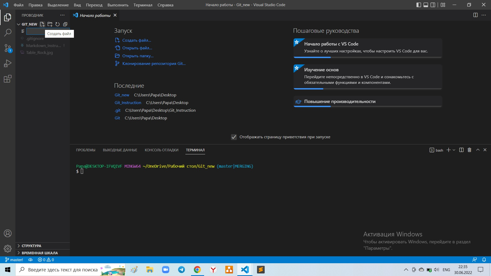
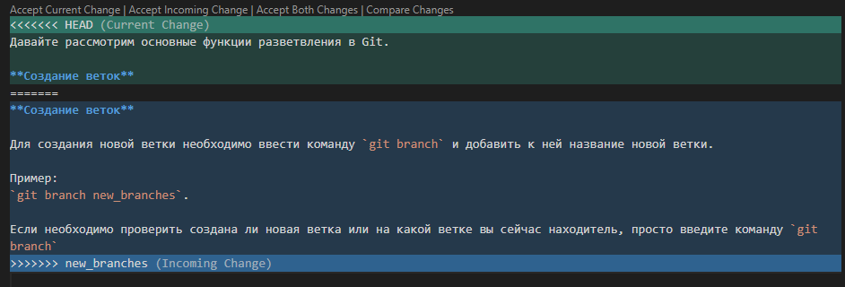
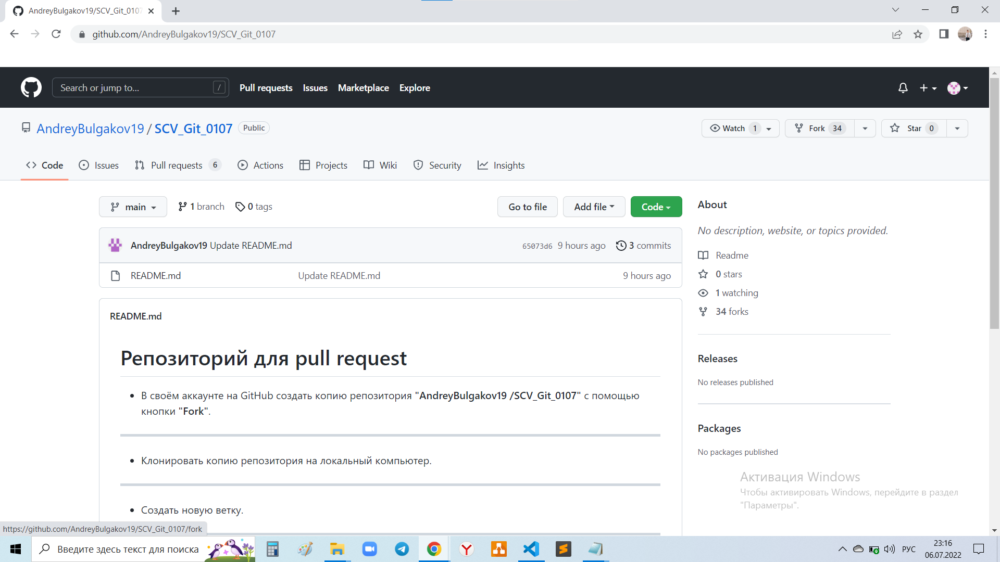
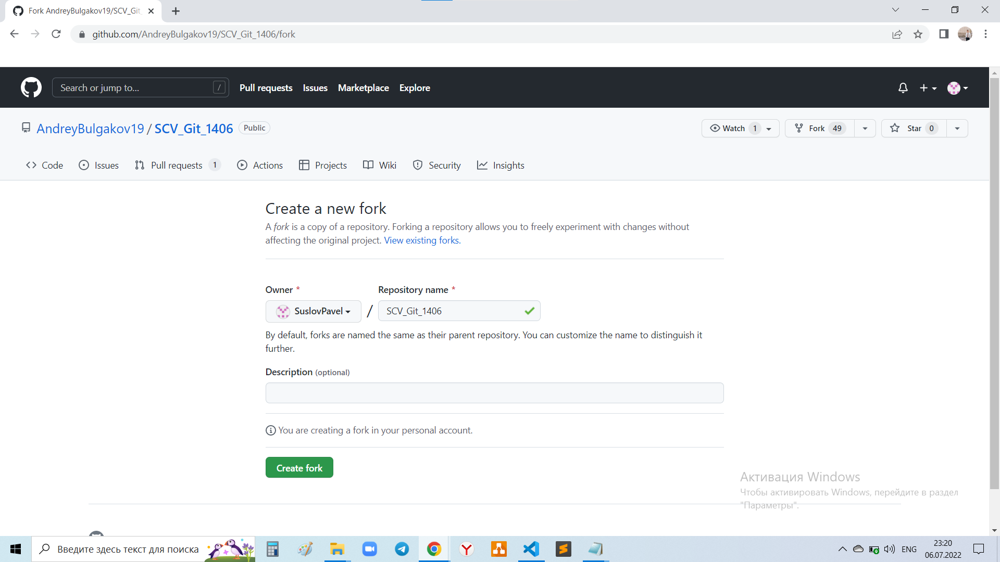
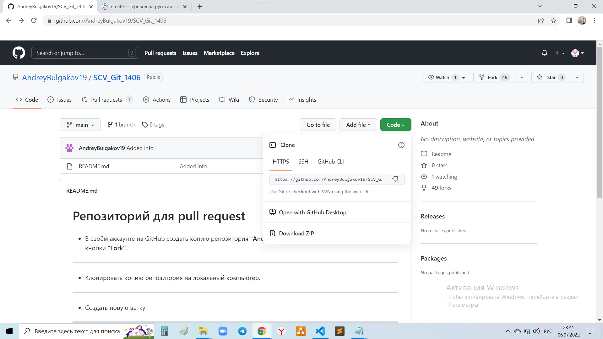
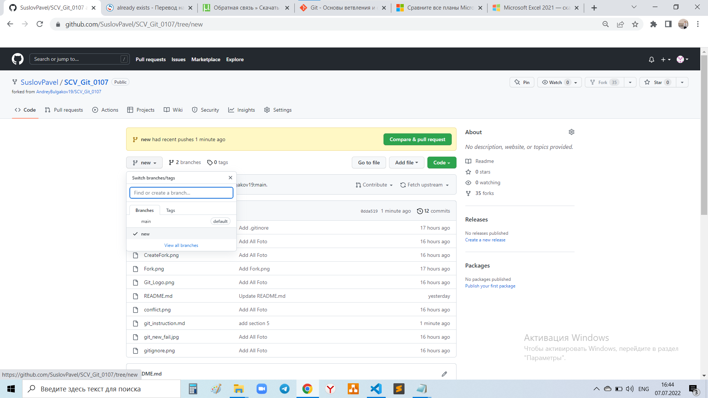

  # Работа с Git
  
  ## 1. Проверка наличия установленого Git
В терминале выполнить команду `Git version`
Если Git установлен появится сообщение с версией программы, иначе будет сообщение об ошибке.

## 2. Установка Git
Загружаем последнюю верстю Git с сайта:

http://git-scm.com/downloads

Устанавливаем с настройками по умолчанию

## 3. Настройка Git
При первом использовании Git необходимо представится. Для этого необходимо вевсти две команды:
```
git config --global user.name "Ваше имя"
git config --global user.email "pochta@pochta.com"
```
## 4. Создание Репозитория
Получить репозиторий можно двумя способами.
1. В терминале переходим к папке в которой хотим создать репозиторий. Вводим команду
```
git init
```
2. Клонировать существующий репозиторий из любого места.
Сделать это можно так:
```
git clone (адрес репозитория)
```
## 5. Запись изменений в репозиторий
Каждый фай в репозитории может находится в одном из двух состояний: под врсионным конторолем (отслеживаемые - tracket) и нет (неотслеживаемые - untracket).

## 6. Создаём новый файл
для этого небходимо в проводнике нажать иконку "новый файл" после чего озаглавить этот файл, обязательно указав расширение "md"


## 7. Сохранение измененений в репозитории
Для этого существут команда
```
git add имя файла
```
## 8. Фиксация изменений 
Для фиксации изменений воспользуемся сомандой 
```
git commit -m "Фиксация изменнений"
```
В ковычках указывается название изменений, понятные для дальнейшей работы.
## 9. Прсмотр разницы изменений
Комманда
```
git diff
````
 выводит на консоль файл, который был изменен. Зеленым показаны строчки, которые были добавлены, а красным которые удалены.
 
 ## 10. Список изменений
Подобный список полезен во многих случаях, например для возврата в предыдущую версию изменений необходим её хэштег (он состоит из символов отмеченых жёлтым шрифтом)
открывается этот список командой
```
git log
```
или более компектной версией при просмотре
```
git log -- oneline
```
## 11. Переход между версиями
Данная функция осуществляется командой
```
git checkout хэшИзменения
```
для возврата к актуальну состоянию подойдет команда
```
git checkout master или git checkout хэшПоследнегоИзменения
```
Для поиска последнего "Хэш" существует команда
```
git reflog
```
также эта команда отлично подойдёт для поиска утраченых данных

## 12. Создание папки .gitignore
Для удобства работы, в репозитории создаётся папка .gitignore в ней можно хранить разного рода временные файла, также ключи,  пароли, ссылки, а ещё можно сразу прописать расширение файлов, например (.jpg) и не прописывать каждую картинку отдельно.
Для создания папки необходимо сделать следующее:
В проводнике нажимаем создать папку далее озаглавливаем её _.gitignore_


## 13. Создание новой ветки
Это одна из важнейших опций Git, зоздание новой ветки необходимо необходимо при командной работе, например если каждым разделом занимается отдельный человек в колективе или при написании альтернативной версии текста.  
Создаётся новая ветка командой
```
git branch ИмяВетки
```
В дальнейшем для того чтобы узнать на какой ветке мы находимся достаточно ввести в терминале
```
git branch
```
ветка присутствия будет отмечена звёздочкой (*) и выделена зелёным цветом.

## 14. Слияние веток и разрешение конфликтов
Для слияния веток первым делом необходимо передти на ветку **master**, в этом поможет команда:
```
git checkout master
```
Далее в терминале пишем команду с указаним той ветки которую решили добавить в основную
```
git merge ИмяВетки
```
При слиянии веток может возникнуть конфликто, произходит это в том случае если строки пересикаются. В этом случае придётся сделать выбор какие изменения принять: текущие (Current), входящие (Incoming), или добавить оба изменения (Both), также программа позволяет срявнить изменения (Compare Changes)


После слияния веток и разрения конфликта, делаем 
```
git commit -am "ИмяКоммита"
```
и продолжаем работу

## 15. Удаление ветки
Когда вы решили избавится от ненужных  веток (например после слияния), на помощь приходит команда
```
git branch -d ИмяВетки
```
разумеется в момент удаления ветки необходимо находится на другой ветке, иначе программа просто не позволит это сделать
Также существуе аналогична комманда
```
git branch -D ИмяВетки
```
Разница заключается в том что вторая команда позволяет удалять даже не слитые ветки.

# Работа с GIT удалённо

## 1. Копирование удалённого репозитория
На https://github.com/ , (далее gh) находим интерисующий нас репозиторий, заходим в него и нажимаем FORK,



 после этого страница обновиться и можно добавить комментарий или изменить имя репозитория, если всё устраивает нажимаем Create Fork

 

 Далее этот репозиторий появится в вашем акаунте на gh, заходим в него и нажимаем вкладку Code, в появившемся окне будет ссылка, копируем её и переходим к следующему этапу.

 

 ## 2. Клонирование репозитория
Теперь открываем Git на локальном компьютере и прописывае команду
```
git clone СсылкаИзGH
```
в результате удадённый репозиторий подтянется на компьютер, со всеми сопутствующими файлами
 
 ## 3. Инициализация Репозитория
 Для продолжения работы репозиторий необходимо инициализировать, но тк это уже было сделано автором проекта, нам потребуется только сменить директорию, для этого существует команда
 ```
 cd ИмяПапки
 ```
 после успешной смены директории можно переходить к следующему пункту

## 4. Следущим шагом будет создание новой ветки - это необходимо сделать тк на данном этапе репозиторий находится на авторской ветке. Создаём ветку и сразу переходим на неё командой
```
git checkout -b ИмяВетки
```
## 5. Отправка репозитория
после завершения работы, локальный репозиторий можно отправлять на свой аккаунт в hg, предварительно сохранив его и проиндексировав, уже знакомыми командами
```
 git add и git commit -m "ИмяМетки"
 ```
 Отправка осуществляется командой
 ```
 git push
 ```
Если всё сделано правильно ваша версия появится на для просмотра проделаной работы и всех коммитов необходимо на gh выбрать ветку в которой проделывались все изменения



## 6. Отправка автору

Это заключительный этап, отправка производится на странице hg, сдесь возможны два сценария развития либо gh сам предложит отправить автору на проверку, обозначив это появившейся строкой с кнопкой __Compare & pull request__ _(Подобное можно наблюдать на последне изображении)_. Либо отправку придётся осуществить самостоятельно, для этого нажимаем кладку Pull request