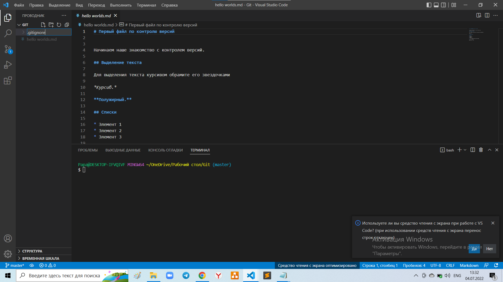

# Работа с Git

## 1. Проверка наличия установленного Git
В терминале выполнить команду `git version`.

Если Git установлен, появится сообщение с 
информацией о версии программы. 
Иначе будет сообщение об ошибке.

## 2. Установка Git

Загружаем последнюю версию Git с сайта:

[https://git-scm.com/downloads](https://git-scm.com/downloads)

Устанавливаем с настройками по умолчанию.

## 3. Настройка Git

При первом использовании Git необходимо
представиться. Для этого нужно ввести в
терминале две команды:
```
git config --global user.name "Ваше имя"
git config --global user.email "yourmail@example.com"
```

## 4. Создание репозитория

Получить репозиторий можно двумя способами.

1. Инициализировать репозиторий при помощи команды:
```
git init
```
2. Клонировать репозиторий при помощи команды:
```
git clone 'address of repository'
```
**Пример:**
```
git clone git@github.com:example/example.git
```
## 5. Запись изменений в репозиторий

Запись изменений в репозиторий можно осуществить 
двумя способами:
* при помощи команды:
```
git add 'file name' 
```

_***(начав вводить имя файла и нажав Tab
вызывается автоподстановка имени файла)_

* при помощи команды
```
git add .
```

_***данная команда позволяет единовременно добавить все имеющиеся файлы_

Далее необходимо добавить так называемый commit.
Делается это при помощи команды:
```
git commit -m "Comment"
```

_***Можно добавить файл и коммит одной командой_:
```
git commit -am "Comment"
```

## 6. Просмотр текущего статуса и разницы между изменениями

Текущий статус можно вывести при помощи команды:

```
git status
```

На выходе получим следующее:


Также мы можем посмотреть разницу между текущей
и последней сохраненной версиями. Это делается
при помощи команды:

> git diff

[подробнее можно ознакомиться здесь](https://git-scm.com/book/ru/v2/%D0%9E%D1%81%D0%BD%D0%BE%D0%B2%D1%8B-Git-%D0%97%D0%B0%D0%BF%D0%B8%D1%81%D1%8C-%D0%B8%D0%B7%D0%BC%D0%B5%D0%BD%D0%B5%D0%BD%D0%B8%D0%B9-%D0%B2-%D1%80%D0%B5%D0%BF%D0%BE%D0%B7%D0%B8%D1%82%D0%BE%D1%80%D0%B8%D0%B9)


## 7. Просмотр истории коммитов

Историю коммитов пожно просмотреть при помощи команды:

> git log

_***Посмотреть сокращенную версию можно при помощи
ключа **--oneline**_:
> git log --oneline

## 8. Перемещение между сохранениями

Перемещение между сохранениями осуществляется при помощи команды:
```
git checkout 'commit hash'
```
_***commit hash - уникальное имя (минимум 4 первых символа),
которое выводится на экран при исполнении команды
**git log**_

Полный перечень ключей, с которыми используется
данная команда представлен на изображении ниже:


****ВАЖНО!**** *При переходе между ветками нужно
быть максимально внимательными и не забывать
возвращаться в ветку master командой:*
> git checkout master

## 9. Игнорирование файлов

Для случаев, когда необходимо исключить файл/файлы
из отслеживания, необходимо выполнить несколько шагов:

1. Создать файл под названием ***__.gitignore__***
2. В файле указать названия файлов, которые будут
исключаться из отслеживания. Например, указать имя изображения, котрое
не нужно отслеживать ***__gitignore.png__***

Файл будет выглядеть следующим образом:



В файле будут записи имен игнорируемых файлов:


## 10. Создание веток

Для создания новой ветки можно воспользоваться
командой:

> git branch <branch_name>
